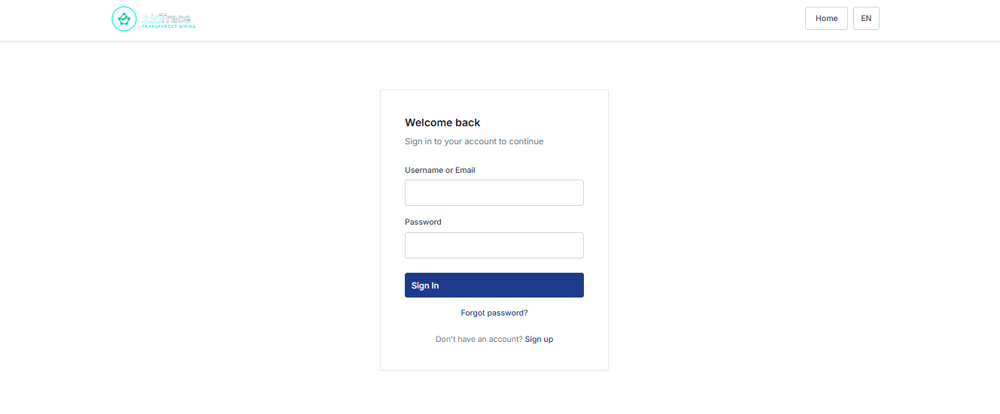
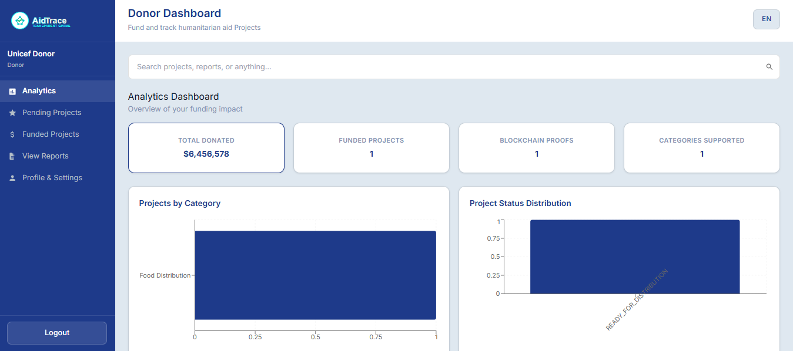
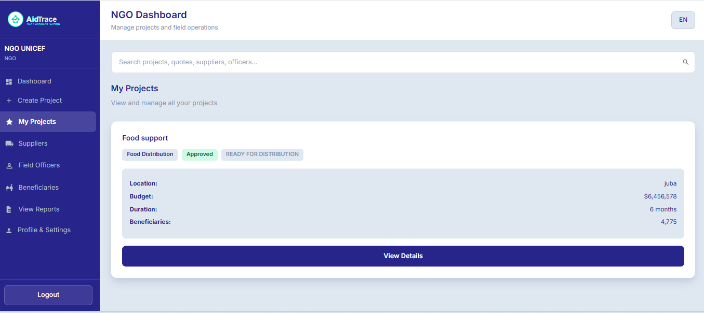
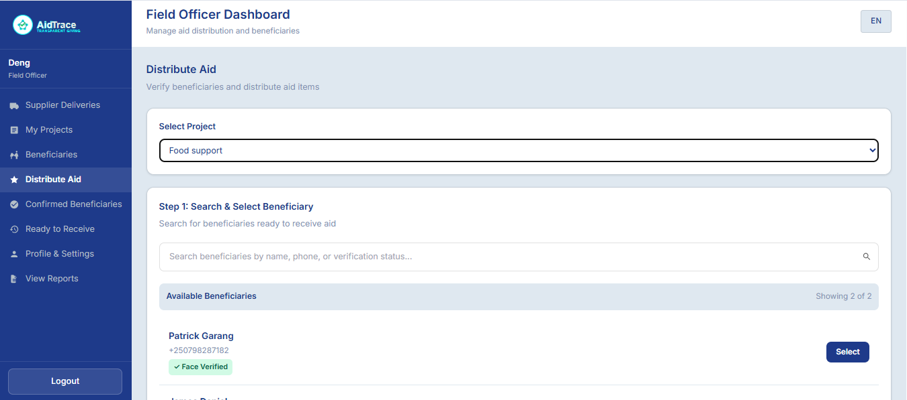

# AidTrace

### Transparent Blockchain-Powered Humanitarian Aid Distribution Platform

---

AidTrace is a humanitarian aid management platform designed to improve transparency and accountability in aid distribution. The system tracks the complete lifecycle of humanitarian aid from donors to beneficiaries using blockchain technology, biometric verification, and secure authentication.

The platform ensures that every critical action in the aid delivery process is recorded and verifiable. By integrating Ethereum smart contracts with traditional web infrastructure, AidTrace creates an immutable audit trail that allows donors, organizations, and auditors to independently verify how aid is distributed.

This approach reduces the risk of corruption, mismanagement, and fraudulent reporting while increasing trust between donors and aid organizations.

---

## Live System

| | |
|---|---|
| **Frontend** | https://aidtrace-southsudan.vercel.app |
| **Backend API** | https://aidtrace98ss-gzchbveebkf3ahfc.southafricanorth-01.azurewebsites.net/api |
| **Smart Contract (Ethereum Sepolia Testnet)** | `0x394D38B35364BB63bF6497b925E9bEF6Bc056Be3` |
| **View Contract on Etherscan** | https://sepolia.etherscan.io/address/0x394D38B35364BB63bF6497b925E9bEF6Bc056Be3 |

---

## Demo Video

**Watch on YouTube:** https://youtu.be/J8uIfkVVmC0

[](https://youtu.be/J8uIfkVVmC0)

> Watch the full platform walkthrough — donor funding, NGO project management, supplier quotes, field officer biometric verification, and blockchain transparency.

---

## Table of Contents

- [Demo Video](#demo-video)
- [System Overview](#system-overview)
- [Key Features](#key-features)
- [System Architecture](#system-architecture)
- [Aid Distribution Workflow](#aid-distribution-workflow)
- [Technology Stack](#technology-stack)
- [Screenshots](#screenshots)
- [Prerequisites](#prerequisites)
- [Installation](#installation)
- [Environment Variables](#environment-variables)
- [Running the Application](#running-the-application)
- [User Roles](#user-roles)
- [Project Lifecycle](#project-lifecycle)
- [Testing](#testing)
- [Project Structure](#project-structure)
- [Deployment](#deployment)
- [Security Considerations](#security-considerations)
- [Contributing](#contributing)
- [License](#license)

---

## System Overview

Humanitarian aid programs often struggle with transparency. Once funds are donated, it becomes difficult to verify whether the resources reach the intended beneficiaries. Lack of accountability can result in corruption, misallocation of resources, and loss of donor trust.

AidTrace addresses this challenge by combining blockchain transparency with identity verification technologies. The platform records key actions — such as project creation, funding, supplier selection, delivery confirmation, and beneficiary distribution — on the Ethereum blockchain.

Each stage in the aid lifecycle requires verification from a specific role. These actions generate blockchain events that cannot be modified or deleted. As a result, the system provides a permanent and publicly verifiable record of how aid is distributed.

AidTrace introduces a structured workflow involving five roles:

- Donor
- NGO
- Supplier
- Field Officer
- Beneficiary

Each participant contributes to the aid delivery process while interacting with a transparent and secure system.

---

## Key Features

**Blockchain Transparency**

AidTrace records critical events on the Ethereum blockchain. These records create a permanent and tamper-proof history of aid distribution activities. Every transaction is publicly verifiable on Etherscan without requiring a login or account.

**Dual Beneficiary Verification**

Aid distribution requires two independent identity checks before the system records aid as delivered:

- Face recognition verification using Face-API.js — a 128-float face descriptor is captured at registration and compared at distribution using Euclidean distance. A match requires a distance below 0.6.
- SMS one-time password confirmation using Twilio — a unique code is sent to the beneficiary's registered phone number and must be entered by the field officer to confirm physical presence.

Both verifications must pass in the same session. Passing only one is not sufficient.

**Competitive Supplier Procurement**

Suppliers submit competitive bids for aid supply contracts. NGOs review all submitted bids and select the most suitable supplier based on pricing and delivery terms. The selected bid is recorded on the blockchain to maintain a transparent and auditable procurement trail.

**Role-Based Access Control**

The platform enforces strict permissions for each user role. Every API endpoint validates the user's JWT role claim before allowing access to specific actions. Requests from the wrong role are rejected with a 403 response.

**Public Transparency Reports**

Members of the public can submit concerns or observations about aid projects through a public reporting interface at `/public-report` — no login required. All submitted reports are publicly visible, providing an external accountability layer independent of the platform's internal roles.

**Multilingual Interface**

The user interface supports both English and Arabic to improve accessibility for field staff and beneficiaries in Arabic-speaking regions.

---

## System Architecture

The architecture separates the user interface, backend services, and blockchain interaction layer to ensure scalability, maintainability, and security.

```
┌─────────────────────────────────────────────────────────┐
│                     React Frontend                       │
│         (Vercel — React 18, Tailwind, Web3.js)          │
└──────────────────────┬──────────────────────────────────┘
                       │ REST API (JWT)
┌──────────────────────▼──────────────────────────────────┐
│                   Django Backend                         │
│     (Azure App Service — DRF, PostgreSQL, Twilio)       │
└──────────┬───────────────────────────┬──────────────────┘
           │ Web3.py                   │ PostgreSQL
┌──────────▼──────────┐   ┌───────────▼──────────────────┐
│  Ethereum Sepolia   │   │   Azure PostgreSQL            │
│  (Alchemy RPC)      │   │   Flexible Server             │
│  AidTrace.sol       │   │                               │
└─────────────────────┘   └───────────────────────────────┘
```

---

## Aid Distribution Workflow

This workflow ensures that every stage in the aid delivery chain is verified by the responsible party before the next stage begins. No stage can be skipped.

```
Donor funds the project
  → NGO creates the project and registers beneficiaries
    → Suppliers submit competitive bids
      → NGO selects the winning supplier quote
        → Supplier confirms they can deliver
          → Field Officer confirms goods arrived at distribution point
            → Beneficiary receives aid (face recognition + SMS OTP)
              → Every action recorded permanently on Ethereum
```

---

## Technology Stack

| Layer | Technology | Purpose |
|---|---|---|
| Frontend | React 18, Tailwind CSS | User interface and dashboards |
| Blockchain Integration | Web3.js | Signing and reading Ethereum transactions from the browser |
| Face Verification | Face-API.js | In-browser biometric identity verification |
| Backend | Django 4, Django REST Framework | REST API, business logic, and role enforcement |
| Database | PostgreSQL 14 | Persistent storage for users, projects, beneficiaries, and quotes |
| Authentication | JWT (HS256) | Stateless token-based auth with embedded role claims |
| OTP Service | Twilio SMS | One-time password delivery for beneficiary verification |
| Smart Contracts | Solidity 0.8.19 | On-chain event logging for all major aid actions |
| Blockchain Tools | Truffle, HDWalletProvider | Contract compilation, migration, and deployment |
| Node Provider | Alchemy | Reliable RPC endpoint for Ethereum Sepolia testnet |
| Deployment | Vercel, Azure App Service | Frontend and backend production hosting |

---

## Screenshots

### Login Interface


### Donor Dashboard


### NGO Project Management


### Field Officer Verification


### Public Transparency Reports


---

## Prerequisites

Install the following software before setting up the project locally.

- **Node.js** v16 or higher — https://nodejs.org
- **Python** v3.10 or higher — https://python.org
- **PostgreSQL** v14 or higher — https://postgresql.org
- **Git** — https://git-scm.com

Verify your installations:

```bash
node --version
python --version
psql --version
git --version
```

---

## Installation

### Clone Repository

```bash
git clone <repository-url>
cd aidtrace_project
```

### Backend Setup

```bash
cd backend

# Create and activate virtual environment
python -m venv venv

# Windows
venv\Scripts\activate
# macOS / Linux
source venv/bin/activate

# Install dependencies
pip install -r requirements.txt

# Copy environment file and fill in your values
cp .env.example .env

# Create database tables
python manage.py migrate

# Create the Admin superuser account
python manage.py createsuperuser
```

Backend runs at `http://localhost:8000`  
Django Admin panel at `http://localhost:8000/admin`

### Frontend Setup

Open a new terminal:

```bash
cd frontend
npm install
```

Create `frontend/.env.local`:

```env
REACT_APP_API_URL=http://localhost:8000/api
```

---

## Running the Application

Both the backend and frontend must run simultaneously. Use two separate terminals.

**Terminal 1 — Backend**

```bash
cd backend
venv\Scripts\activate      # Windows
# source venv/bin/activate # macOS / Linux
python manage.py runserver
```

**Terminal 2 — Frontend**

```bash
cd frontend
npm start
```

Frontend available at `http://localhost:3000`

---

## Environment Variables

### `backend/.env`

Copy `backend/.env.example` and fill in your values:

```env
# Database
DB_NAME=aidtrace_db
DB_USER=postgres
DB_PASSWORD=your_password
DB_HOST=localhost
DB_PORT=5432

# Django
SECRET_KEY=your-long-random-secret-key
DEBUG=True
ALLOWED_HOSTS=localhost,127.0.0.1

# Blockchain
BLOCKCHAIN_NETWORK=sepolia
SEPOLIA_CONTRACT_ADDRESS=0x3c94D38B35364BB63bF6497b925E9bEF6Bc056Be3
ALCHEMY_API_KEY=your_alchemy_key
BLOCKCHAIN_PRIVATE_KEY=your_wallet_private_key

# Twilio OTP
TWILIO_ACCOUNT_SID=your_twilio_sid
TWILIO_AUTH_TOKEN=your_twilio_token
TWILIO_PHONE_NUMBER=+1xxxxxxxxxx

# Email (Gmail SMTP for password reset)
EMAIL_HOST_USER=your_email@gmail.com
EMAIL_HOST_PASSWORD=your_gmail_app_password

# Frontend URL
FRONTEND_URL=http://localhost:3000
```

### `blockchain/.env`

```env
MNEMONIC=word1 word2 word3 word4 word5 word6 word7 word8 word9 word10 word11 word12
ALCHEMY_API_KEY=your_alchemy_api_key
ETHERSCAN_API_KEY=your_etherscan_api_key
```

> Never commit `.env` files to version control. All environment files are listed in `.gitignore`.

---

## User Roles

AidTrace enforces a strict 5-role permission model. Every API endpoint checks the JWT role claim before allowing access.

| Role | Responsibilities |
|---|---|
| **Admin** | Approves or rejects new user registrations. Monitors all projects, users, and blockchain activity across the platform. |
| **Donor** | Browses active aid projects and funds them by signing Ethereum transactions via a Web3 wallet. |
| **NGO** | Creates aid projects, registers beneficiaries including face photo upload, and manages the supplier quote process. |
| **Supplier** | Receives quote requests from NGOs, submits competitive bids with pricing and delivery details, and confirms delivery completion. |
| **Field Officer** | Verifies beneficiary identity on the ground using face recognition and SMS OTP before recording aid distribution. |

> All new registrations start as inactive. An Admin must approve the account before the user can log in.

---

## Project Lifecycle

AidTrace enforces a strict 10-stage project lifecycle. Each stage requires confirmation from the responsible role and cannot be skipped.

| Stage | Status | Responsible Role |
|---|---|---|
| 1 | Project Created | NGO |
| 2 | Pending Funding | Donor |
| 3 | Fully Funded | System |
| 4 | Quote Request Sent | NGO |
| 5 | Supplier Quote Selected | NGO |
| 6 | Supplier Confirmation | Supplier |
| 7 | Field Officer Verification | Field Officer |
| 8 | Ready for Distribution | System |
| 9 | Aid Distribution in Progress | Field Officer |
| 10 | Project Completed | System |

---

## Testing

AidTrace contains 208 automated tests covering frontend, backend, security, and blockchain layers.

| Test Category | File | Count |
|---|---|---|
| Frontend Unit Tests | `frontend/src/tests/unit.test.js` | 34 |
| Frontend Integration Tests | `frontend/src/tests/integration.test.js` | 25 |
| Component Render Tests | `frontend/src/tests/` | 39 |
| System E2E Tests | `frontend/cypress/e2e/system.cy.js` | 22 |
| Security E2E Tests | `frontend/cypress/e2e/security.cy.js` | 23 |
| Backend Integration Tests | `backend/tests/test_api.py` | 13 |
| Backend Security Tests | `backend/tests/test_security.py` | 38 |
| Blockchain Python Tests | `backend/tests/test_blockchain.py` | 10 |
| Smart Contract Tests | `blockchain/test/AidTrace.test.js` | 4 |
| **Total** | | **208** |

**Run frontend tests**

```bash
cd frontend
npm run test:all
```

**Run backend tests**

```bash
cd backend
python manage.py test tests --verbosity=2
```

**Run blockchain tests**

```bash
cd blockchain
truffle test
```

**Run Cypress E2E tests** (requires frontend running on `localhost:3000`)

```bash
# Terminal 1
cd frontend && npm start

# Terminal 2
cd frontend
npm run cypress:system
npm run cypress:security
```

---

## Project Structure

```
aidtrace_project/
├── backend/
│   ├── api/
│   │   ├── models.py              # 15 Django models
│   │   ├── views.py               # Role-based API views
│   │   ├── auth.py                # JWT authentication
│   │   ├── blockchain.py          # Web3.py blockchain service
│   │   ├── blockchain_verify.py   # On-chain verification endpoints
│   │   ├── quote_views.py         # NGO quote management
│   │   ├── supplier_quote_views.py # Supplier bid submission
│   │   ├── bulk_beneficiary.py    # CSV bulk beneficiary import
│   │   ├── otp_service.py         # Twilio OTP integration
│   │   ├── serializers.py         # DRF serializers
│   │   ├── urls.py                # 50+ URL patterns
│   │   ├── validators/            # Custom field validators
│   │   └── services/              # Business logic services
│   ├── tests/
│   │   ├── test_api.py            # Integration and unit tests
│   │   ├── test_security.py       # RBAC and auth security tests
│   │   └── test_blockchain.py     # Blockchain service tests
│   ├── aidtrace/
│   │   └── settings.py            # Django configuration
│   ├── .env.example               # Environment variable template
│   └── requirements.txt           # Python dependencies
├── frontend/
│   ├── src/
│   │   ├── pages/                 # Role dashboards and auth pages
│   │   ├── components/            # Shared UI components
│   │   ├── services/api.js        # Axios API client (7 modules)
│   │   ├── utils/validation.js    # Pure validation functions
│   │   ├── config/                # Contract ABI and blockchain config
│   │   ├── translations.js        # Arabic and English translations
│   │   └── tests/                 # Jest test suites
│   └── cypress/
│       └── e2e/                   # Cypress E2E test specs
├── blockchain/
│   ├── contracts/AidTrace.sol     # Solidity 0.8.19 smart contract
│   ├── migrations/                # Truffle deployment scripts
│   ├── test/AidTrace.test.js      # Contract tests
│   └── truffle-config.js          # Network configuration
└── .github/
    └── workflows/
        └── main_aidtrace98ss.yml  # GitHub Actions CI/CD pipeline
```

---

## Deployment

| Component | Platform | Region |
|---|---|---|
| Frontend | Vercel | Global CDN |
| Backend | Azure App Service | South Africa North |
| Database | Azure PostgreSQL Flexible Server | South Africa North |
| Blockchain | Ethereum Sepolia Testnet via Alchemy | Decentralized |

**Deploy Frontend to Vercel**

Vercel auto-deploys on every push to the `main` branch. Set the following environment variable in the Vercel dashboard:

```
REACT_APP_API_URL=https://aidtrace98ss-gzchbveebkf3ahfc.southafricanorth-01.azurewebsites.net/api
```

**Deploy Backend to Azure**

The backend deploys automatically via GitHub Actions on push to `main`. The workflow is defined in `.github/workflows/main_aidtrace98ss.yml`. Azure runs `startup.sh` on deployment, which applies database migrations and starts the Gunicorn server.

---

## Security Considerations

Sensitive credentials must never be committed to version control. All `.env` files are listed in `.gitignore`.

Important secrets include:

- Django `SECRET_KEY` — used to sign JWT tokens. Rotating this key invalidates all active sessions.
- `BLOCKCHAIN_PRIVATE_KEY` — used by the backend to sign on-chain transactions. Use a dedicated wallet with only enough ETH for gas fees, never a personal wallet.
- Wallet `MNEMONIC` — derives the deployer wallet private key. Anyone with this phrase controls the wallet. Rotate immediately if exposed.
- Twilio authentication tokens — control SMS delivery and billing.
- Database credentials — restrict access to the backend service only.

Production recommendations:

- Set `DEBUG=False` in `backend/.env` to prevent Django from exposing internal stack traces
- Use a dedicated blockchain wallet with minimal ETH balance
- Rotate any credentials that have been exposed or committed to version control
- Restrict `ALLOWED_HOSTS` to your production domain only

---

## Contributing

Contributions are welcome.

1. Fork the repository
2. Create a feature branch

```bash
git checkout -b feature-name
```

3. Commit your changes

```bash
git commit -m "Add new feature"
```

4. Push the branch

```bash
git push origin feature-name
```

5. Submit a Pull Request

Ensure all 208 tests pass before submitting changes.

```bash
cd frontend && npm run test:all
cd backend && python manage.py test tests --verbosity=2
```

---

## License

This project is licensed under the MIT License.

See the [LICENSE](LICENSE) file for details.
